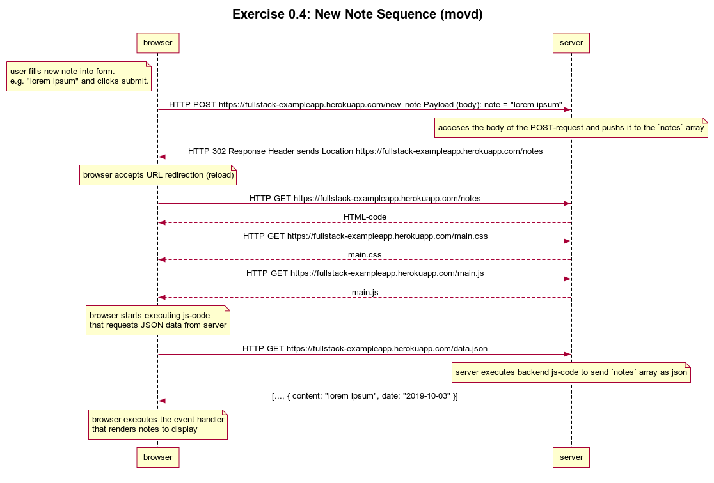
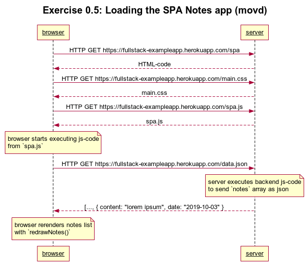

# Answers to Exercises for Part 0 

My answers for [Exercises Part 0](https://fullstackopen.com/en/part0/fundamentals_of_web_apps#exercises). 

## 0.4 Diagram for New note

The following Diagram describes the creation of a new note in the [traditional web-application](https://fullstack-exampleapp.herokuapp.com/notes).



My code used to render with [websequencediagrams](https://www.websequencediagrams.com):

```
title Exercise 0.4: New Note Sequence (movd)

note left of browser:
user fills new note into form. 
e.g. "lorem ipsum" and clicks submit.
end note

browser->server: HTTP POST https://fullstack-exampleapp.herokuapp.com/new_note Payload (body): note = "lorem ipsum"
note over server:
acceses the body of the POST-request and pushs it to the `notes` array
end note

server-->browser: HTTP 302 Response Header sends Location https://fullstack-exampleapp.herokuapp.com/notes 
note over browser:
browser accepts URL redirection (reload)
end note:

browser->server: HTTP GET https://fullstack-exampleapp.herokuapp.com/notes
server-->browser: HTML-code
browser->server: HTTP GET https://fullstack-exampleapp.herokuapp.com/main.css
server-->browser: main.css
browser->server: HTTP GET https://fullstack-exampleapp.herokuapp.com/main.js
server-->browser: main.js

note over browser:
browser starts executing js-code
that requests JSON data from server 
end note

browser->server: HTTP GET https://fullstack-exampleapp.herokuapp.com/data.json
note over server:
server executes backend js-code to send `notes` array as json
end note
server-->browser: [..., { content: "lorem ipsum", date: "2019-10-03" }] 

note over browser:
browser executes the event handler
that renders notes to display
end note
```

## 0.5 Sequence for loading the single page Notes app 

The following Diagram describes the loading of the [single page web-application](https://fullstack-exampleapp.herokuapp.com/spa).



My code used to render with [websequencediagrams](https://www.websequencediagrams.com):

```
title Exercise 0.5: Loading the SPA Notes app (movd)

browser->server: HTTP GET https://fullstack-exampleapp.herokuapp.com/spa
server-->browser: HTML-code
browser->server: HTTP GET https://fullstack-exampleapp.herokuapp.com/main.css
server-->browser: main.css
browser->server: HTTP GET https://fullstack-exampleapp.herokuapp.com/spa.js
server-->browser: spa.js

note over browser:
browser starts executing js-code 
from `spa.js` 
end note

browser->server: HTTP GET https://fullstack-exampleapp.herokuapp.com/data.json
note over server:
server executes backend js-code 
to send `notes` array as json
end note

server-->browser: [..., { content: "lorem ipsum", date: "2019-10-03" }

note over browser:
browser rerenders notes list 
with `redrawNotes()`
end note
```


## 0.6 Sequence for creating a new note in the single page Notes app 

The following Diagram describes the creation of a new note in the [single page web-application](https://fullstack-exampleapp.herokuapp.com/spa).


My code used to render with [websequencediagrams](https://www.websequencediagrams.com):

```
title Exercise 0.6: New Note with the SPA Notes app (movd)

note over browser:
user fills new note into form. 
e.g. "lorem ipsum" and clicks submit.

browser pushes "lorem ipsum" to `notes` local array.

browser rerenders the list of notes.

browser creates POST payload via 
js-code from `spa.js`

Payload body = 
(JSON {content: "lorem ipsum", "2019-10-03"})
end note
browser->server: HTTP POST https://fullstack-exampleapp.herokuapp.com/new_note_spa 

note over server:
server acceses the body of the 
POST-request and pushs it to the `notes` array
end note
server --> browser: HTTP 201 Created JSON {"message":"note created"}
```